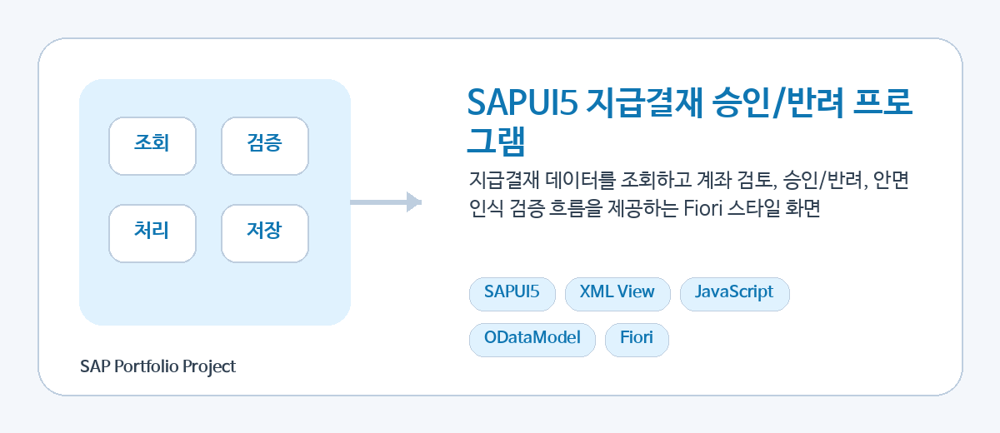
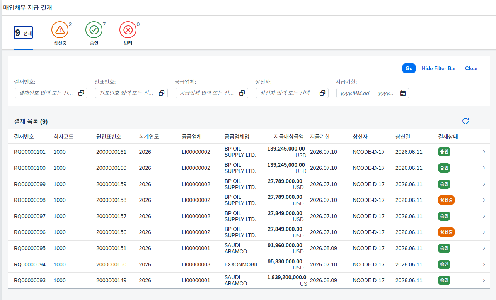
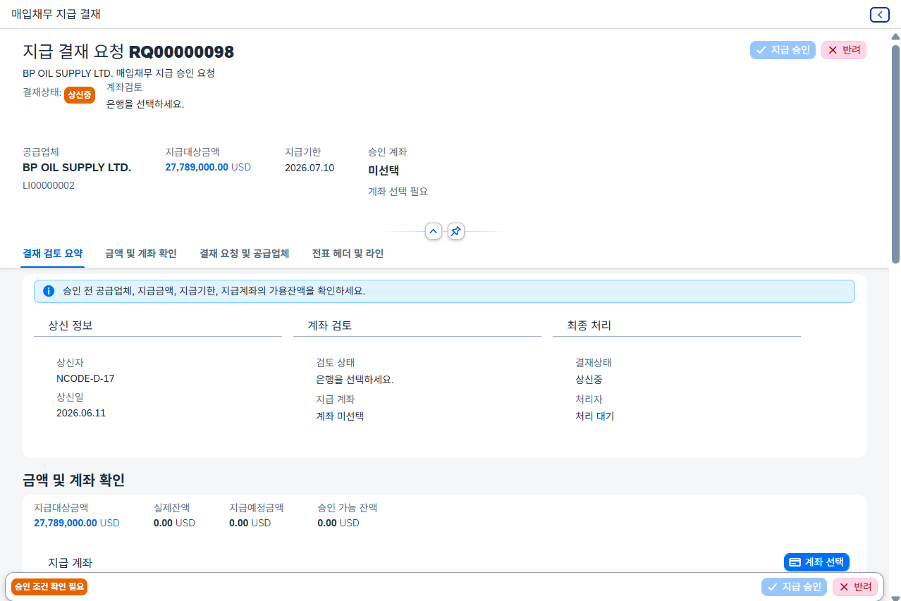
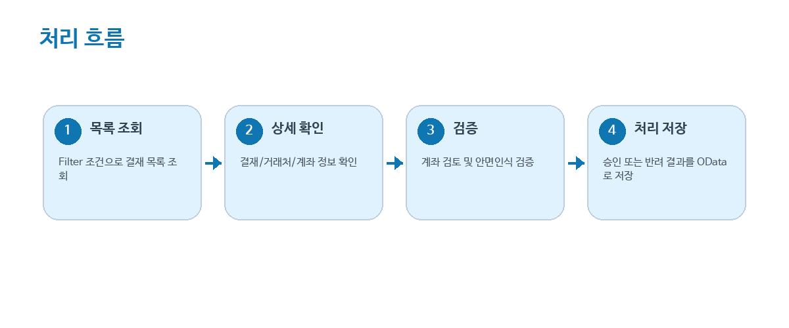

# SAPUI5 Payment Approval

<p align="center">
  
</p>

<p align="center">
  
  
  
  
  
</p>

<br/>

## 📌 프로젝트 소개

SAPUI5 기반의 **매입채무 지급 결재 프로그램**입니다.

FI 매입채무 지급 대상 데이터를 조회하고, 지급 계좌의 가용잔액을 검토한 뒤 승인 또는 반려 처리를 수행합니다.
승인 단계에서는 결재자 본인 확인을 위해 **안면 인증 로직**을 적용했습니다.

이 프로젝트는 단순한 결재 버튼 화면이 아니라, 실제 지급 승인 전에 필요한 업무 조건을 화면에서 단계적으로 검토할 수 있도록 구성했습니다.

<br/>

---

## 🖥️ 화면 미리보기

### 1. 결재 목록 화면

<p align="center">
  
</p>

결재 목록 화면에서는 전체, 상신중, 승인, 반려 상태별로 결재 데이터를 조회할 수 있습니다.

주요 기능은 다음과 같습니다.

* 상태별 결재 건수 조회
* 결재번호, 전표번호, 공급업체, 상신자, 지급기한 기준 검색
* MultiInput Token 기반 다중 조건 검색
* 지급기한, 상신일, 거래금액, 공급업체명 기준 정렬
* 결재 건 선택 시 상세 화면 이동

<br/>

### 2. 결재 상세 화면

<p align="center">
  
</p>

상세 화면에서는 선택한 결재 건의 지급 정보, 공급업체 정보, 계좌 검토 결과, 전표 근거를 확인할 수 있습니다.

상신중, 승인, 반려 상태에 따라 화면 표시 내용과 버튼 활성화 여부가 달라집니다.

<br/>

### 3. 처리 흐름

<p align="center">
  
</p>

<br/>

---

## ✅ 주요 기능

## 1. 결재 목록 조회

* 전체 / 상신중 / 승인 / 반려 상태별 결재 목록 조회
* 상태별 건수 표시
* 결재번호 Search Help
* 전표번호 Search Help
* 공급업체 Search Help
* 상신자 Search Help
* 지급기한 Date Range 검색
* 조건 입력 후 Token 기반 필터 적용

<br/>

## 2. 결재 상세 조회

* 결재번호, 결재상태, 상신자, 승인자, 반려자 정보 조회
* 회사코드, 원전표번호, 회계연도, 개별항목 확인
* 공급업체, 지급조건, 지급방법, 지급기한 확인
* 지급대상금액 및 통화 확인
* 반려 건의 경우 반려 사유 별도 표시

<br/>

## 3. 지급 계좌 검토

* 지급 계좌 선택 Dialog 제공
* 은행ID, 은행명, 계좌번호, G/L 계정, 통화 조회
* 실제잔액, 지급예정금액, 가용잔액 확인
* 월마감 계좌 선택 제한
* 가용잔액 부족 시 승인 제한
* 승인 가능 조건 충족 시 승인 버튼 활성화

<br/>

## 4. 승인 처리

* 상신중 상태의 결재 건만 승인 가능
* 지급 계좌가 선택되어야 승인 가능
* 가용잔액이 지급대상금액 이상이어야 승인 가능
* 승인 전 안면 인증 Dialog 실행
* 등록된 얼굴 정보와 현재 얼굴 정보를 비교
* 인증 성공 시 결재 승인 처리

<br/>

## 5. 반려 처리

* 상신중 상태의 결재 건만 반려 가능
* 반려 사유 필수 입력
* 반려 사유 최대 255자 제한
* 반려 처리 후 상세 데이터 재조회

<br/>

---

## 🔐 안면 인증 흐름

승인 버튼을 누르면 안면 인증 Dialog가 실행됩니다.
카메라 화면을 사용자에게 직접 크게 노출하지 않고, 내부적으로 얼굴 정보를 분석하여 결재자 본인 여부를 검증합니다.

```text
1. 승인 버튼 클릭
   ↓
2. face-api.js 로드
   ↓
3. 얼굴 인식 모델 로드
   ↓
4. 카메라 권한 확인
   ↓
5. 등록된 결재자 얼굴 정보 조회
   ↓
6. 현재 얼굴 Descriptor 추출
   ↓
7. 등록 Descriptor와 거리 비교
   ↓
8. 인증 성공 시 승인 처리
```

<br/>

사용 파일 구조는 다음과 같습니다.

```text
thirdparty/
└── face-api.min.js

models/
└── faceapi/
    ├── tiny_face_detector_model-weights_manifest.json
    ├── tiny_face_detector_model-shard1
    ├── face_landmark_68_model-weights_manifest.json
    ├── face_landmark_68_model-shard1
    ├── face_recognition_model-weights_manifest.json
    ├── face_recognition_model-shard1
    └── face_recognition_model-shard2
```

<br/>

---

## 🧩 화면 구성

## Main View

```text
Main.view.xml
└── Page
    └── IconTabBar
        ├── 전체
        ├── 상신중
        ├── 승인
        └── 반려
            └── FilterBar
            └── Table / PayApvListSet
```

<br/>

## Detail View

```text
Detail.view.xml
└── ObjectPageLayout
    ├── Header Title
    ├── 결재 검토 요약
    ├── 금액 및 계좌 확인
    ├── 결재 상세 정보
    ├── 반려 사유
    └── 원전표 근거
```

<br/>

## Dialog

| Dialog                             | 역할               |
| ---------------------------------- | ---------------- |
| `BankDialog.fragment.xml`          | 지급 계좌 선택         |
| `RejectDialog.fragment.xml`        | 반려 사유 입력         |
| `FaceApproveDialog.fragment.xml`   | 안면 인증 진행         |
| `SupplierHelpDialog.fragment.xml`  | 공급업체 Search Help |
| `RequesterHelpDialog.fragment.xml` | 상신자 Search Help  |
| `ApvNoHelpDialog.fragment.xml`     | 결재번호 Search Help |
| `BelnrHelpDialog.fragment.xml`     | 전표번호 Search Help |

<br/>

---

## 🔄 전체 처리 흐름

```text
1. 결재 목록 조회
   ↓
2. 상태별 필터 또는 검색 조건 입력
   ↓
3. 결재 건 선택
   ↓
4. 상세 화면 이동
   ↓
5. 지급 계좌 검토
   ├── 월마감 계좌 여부 확인
   ├── 가용잔액 확인
   └── 승인 가능 여부 판단
   ↓
6. 승인 또는 반려
   ├── 승인: 안면 인증 후 승인 처리
   └── 반려: 반려 사유 입력 후 반려 처리
```

<br/>

---

## 🛠️ 사용 기술

| 구분                   | 기술                                                                   |
| -------------------- | -------------------------------------------------------------------- |
| Frontend             | SAPUI5, XML View, JavaScript                                         |
| UI Pattern           | Fiori Worklist, Object Page, Dialog                                  |
| Data Binding         | JSONModel, ODataModel                                                |
| SAP Integration      | SAP Gateway OData                                                    |
| Authentication Logic | face-api.js                                                          |
| UI Controls          | IconTabBar, FilterBar, Table, ObjectPageLayout, Dialog, ObjectStatus |
| Formatting           | Currency Formatting, Date Formatting, Status Formatter               |

<br/>

---

## 🔗 주요 OData EntitySet

| EntitySet          | 용도                       |
| ------------------ | ------------------------ |
| `PayApvListSet`    | 결재 목록 조회                 |
| `PayApvDetailSet`  | 결재 상세 조회 및 승인/반려 상태 업데이트 |
| `PayApvBankBalSet` | 지급 계좌 및 잔액 정보 조회         |
| `FaceRegisterSet`  | 결재자 얼굴 등록 정보 조회          |

<br/>

---

## 📁 프로젝트 구조

```text
paymentaprove
├── controller
│   ├── App.controller.js
│   ├── Main.controller.js
│   ├── Detail.controller.js
│   └── NotFound.controller.js
│
├── view
│   ├── App.view.xml
│   ├── Main.view.xml
│   ├── Detail.view.xml
│   ├── NotFound.view.xml
│   ├── BankDialog.fragment.xml
│   ├── RejectDialog.fragment.xml
│   ├── FaceApproveDialog.fragment.xml
│   ├── SupplierHelpDialog.fragment.xml
│   ├── RequesterHelpDialog.fragment.xml
│   ├── ApvNoHelpDialog.fragment.xml
│   └── BelnrHelpDialog.fragment.xml
│
├── model
│   ├── formatter.js
│   └── models.js
│
├── models
│   └── faceapi
│
├── thirdparty
│   └── face-api.min.js
│
├── css
├── i18n
├── localService
├── test
├── Component.js
├── index.html
└── manifest.json
```

<br/>

---

## 💡 핵심 구현 포인트

## 1. 상태별 목록 관리

결재상태는 다음 기준으로 구분했습니다.

| 상태 코드 | 의미  |
| ----- | --- |
| `REQ` | 상신중 |
| `APR` | 승인  |
| `REJ` | 반려  |

상태별 건수는 `$count` 조회를 통해 갱신하며, 목록은 상태 필터와 검색 필터를 함께 적용합니다.

<br/>

## 2. Token 기반 검색 조건 처리

검색 조건은 MultiInput Token 방식으로 처리했습니다.
입력값은 공백, 쉼표, 줄바꿈 기준으로 분리하여 Token으로 변환하고, 동일 필드 내 여러 값은 OR 조건으로 필터링합니다.

<br/>

## 3. 계좌 승인 가능 여부 판단

지급 계좌 검토 시 다음 조건을 확인합니다.

```text
1. 계좌가 월마감 상태인지 확인
2. 가용잔액이 지급대상금액보다 충분한지 확인
3. 조건을 만족하면 승인 버튼 활성화
```

<br/>

## 4. 반려 처리

반려 처리 시 반려 사유를 필수로 입력받고, 결재 상태를 `REJ`로 변경합니다.

```javascript
{
  ApvStat: "REJ",
  RejRsn: sReason
}
```

<br/>

## 5. 안면 인증 처리

안면 인증은 다음 순서로 동작합니다.

```text
face-api.js 로드
→ 얼굴 인식 모델 로드
→ 카메라 실행
→ 등록 얼굴 정보 조회
→ 현재 얼굴 Descriptor 추출
→ 등록 Descriptor와 거리 비교
→ 인증 성공 시 승인 처리
```

<br/>

---

## 🚀 실행 조건

이 프로젝트는 SAP Gateway OData 서비스와 연동되는 SAPUI5 애플리케이션입니다.
정상 실행을 위해서는 다음 항목이 필요합니다.

* SAPUI5 Runtime
* SAP Gateway OData Service
* 지급결재 관련 OData Service
* 얼굴 등록 정보 조회용 OData Service
* 브라우저 카메라 권한
* `models/faceapi` 모델 파일
* `thirdparty/face-api.min.js`

<br/>

---

## 🎯 개발 의도

지급 결재는 단순히 승인 버튼을 누르는 업무가 아니라, 지급 계좌와 가용잔액을 확인한 뒤 처리되어야 하는 업무입니다.

이 프로젝트에서는 사용자가 승인 전에 다음 정보를 한 화면에서 검토할 수 있도록 구성했습니다.

* 결재 상태
* 공급업체 정보
* 지급대상금액
* 지급기한
* 지급 계좌
* 실제잔액
* 지급예정금액
* 가용잔액
* 결재자 본인 여부

이를 통해 지급 결재 처리 전에 필요한 정보를 명확하게 확인하고, 승인 가능 여부를 직관적으로 판단할 수 있도록 했습니다.

<br/>

---

## 📌 Portfolio Point

이 프로젝트를 통해 다음 역량을 보여줄 수 있습니다.

* SAPUI5 XML View 기반 업무 화면 구성
* ODataModel 기반 SAP Gateway 서비스 연동
* Fiori 스타일의 Worklist / Object Page 화면 설계
* 결재 상태별 UI 제어
* Dialog 기반 사용자 입력 처리
* 지급 계좌 잔액 검증 로직 구현
* 안면 인증을 활용한 승인 보안 로직 적용
* JavaScript Controller 기반 이벤트 처리 및 화면 상태 관리
